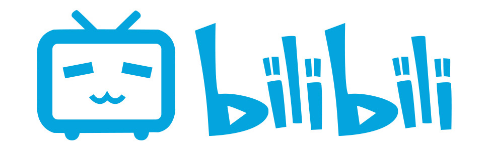

<h1>bblili</h1>

<b>仿bilibili后端项目</b>

## 项目简介
参考BiliBili视频网站，采用微服务架构实现**用户、视频、弹幕、三连**等核心功能。底层采用缓存、消息队列以及分布式文件服务器等技术支持海量用户操作。
- 使用**ElasticSearch**实现**全文检索并且高亮搜索字段**，让用户拥有良好的搜索体验
- 使用**MinIO**搭建分布式文件系统，实现视频**分片上传、断点续传、在线播放**等功能
- 使用**WebSocket**实现长连接，**发送实时弹幕**，进行**在线观看人数统计**
- todo: 使用**RocketMQ**实现**动态消息异步推送**，提升了动态发送，视频上传的速度
- 使用**Redis缓存**动态、弹幕相关信息，提升了**动态列表以及弹幕流的响应速度**，降低数据库压力
- todo: 使⽤**布隆过滤器，Redis**避免⾼并发注册⽤⼾带来的缓存穿透问题，减轻数据库访问压⼒。